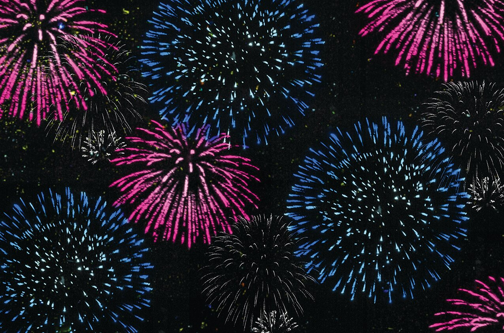
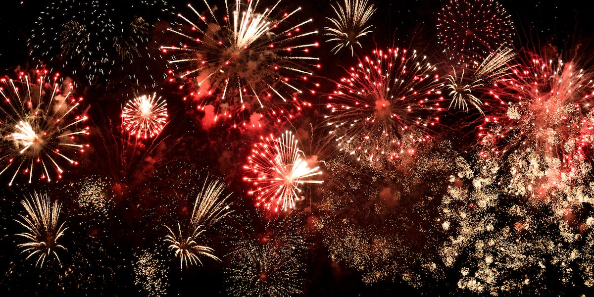

# Week 8 Quiz
## Part 1: Imaging Technique Inspiration
### My Chosen Example:

***
### Why:
#### Fireworks art has a transient and explosive aesthetic that provides a significant visual impact, making it very suitable for representing the artworks in our project. For example, in “The Scream”, the explosive colors and light points of fireworks art can be used to express the intense psychological state depicted in the artwork. In “Ntange II (Grass)”, the spreading visual effects of fireworks art can echo the strong color effects and vitality of the piece. In “Saint-Georges-Majeur au crépuscule”, fireworks art can simulate the glow and flowing colors of sunset, bringing the scene to life with dynamic beauty.
***
## Part 2: Coding Technique Exploration
### The Coding Technique:
- *Visual Effect*

***
- *Link and Instruction*
   - After clicking the link, please click the icon at the top right to view the code.

   - [Code Link](https://openprocessing.org/sketch/1709770)
***
### How:
#### This code creates complex and random visual effects using functions like random(), showing a dynamic scene of numerous fireworks bursting simultaneously, which presents a dense beauty and effectively simulates the dazzling effects and unpredictable nature of fireworks. After bursting, the fireworks do not disappear but remain on the screen, turning moments into eternity. Additionally, each time the screen refreshes, the colors of the fireworks change, creating a vibrant and continually evolving visual experience that ensures each viewing is unique.